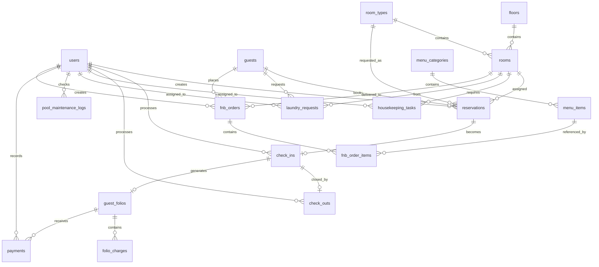
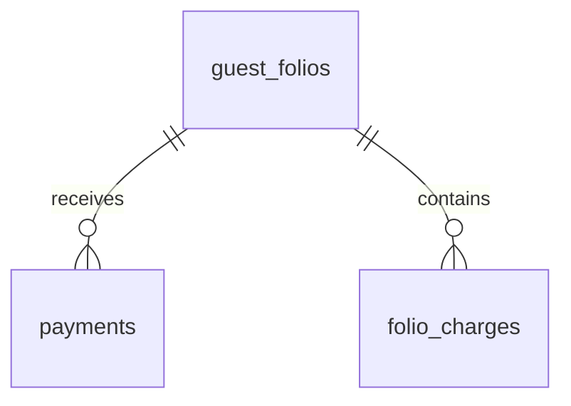
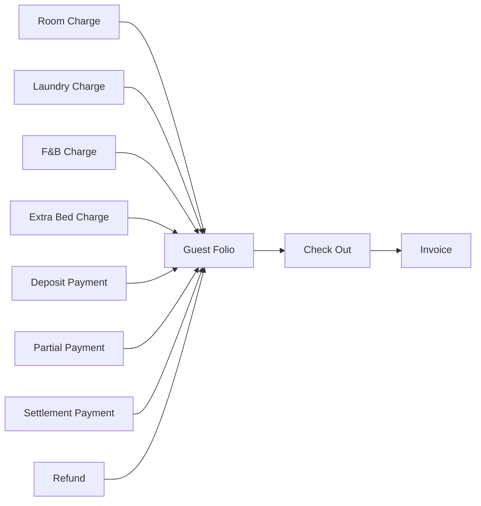
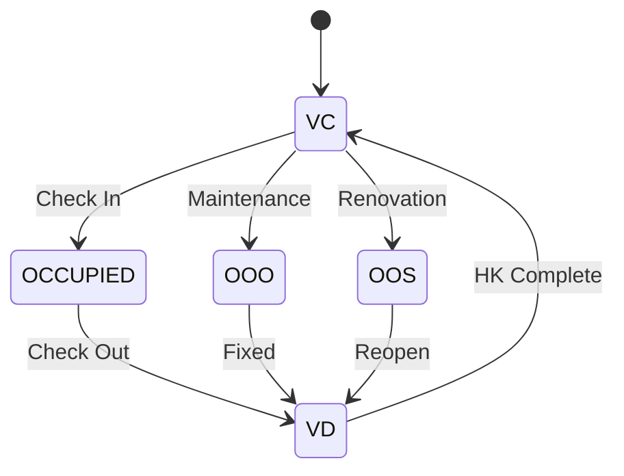

# ERD — PPKD Hotel Management System

**Version:** 2.0 (Final, Consolidated)
**Menggantikan:** ERD.md v1.0 dan diagram ERD di PRD_V3_UPDATE.md secara penuh

**Stack:** Laravel 13, MySQL 8, Inertia.js, React, Spatie Permission, Spatie Activitylog

---

# 1. Domain Overview

Sistem dibagi menjadi 8 domain utama:

1. Authentication & Authorization
2. Master Data (Floor, Room Type, Room)
3. Reservation
4. Guest Stay (Check-In / Check-Out)
5. Billing & Payment
6. Housekeeping (Tasks, Laundry, Pool Maintenance)
7. F&B (Menu, Orders)
8. System (Settings, Audit Log)

---

# 2. High Level ERD (Lengkap)



---

# 3. Authentication & Authorization Domain

## users

Staff hotel.

```text
User
 ├── Administrator
 ├── Front Office
 ├── Housekeeping
 └── F&B Service
```

### Relationships
- `hasMany` reservations (sebagai pembuat)
- `hasMany` check_ins, check_outs (sebagai pemroses)
- `hasMany` housekeeping_tasks (sebagai assignee)
- `hasMany` laundry_requests (sebagai assignee)
- `hasMany` pool_maintenance_logs (sebagai pemeriksa)
- `hasMany` payments (sebagai pencatat transaksi)
- `hasMany` fnb_orders (sebagai pembuat order)

### Authorization Tables (Spatie Permission)

```text
roles
permissions
model_has_roles
model_has_permissions
role_has_permissions
```

### Audit Tables (Spatie Activitylog)

```text
activity_log
```

---

# 4. Master Data Domain

## floors

Master lantai/tower bangunan hotel.

```text
Floor
  └── hasMany Rooms
```

## room_types

Master tipe kamar (STD, DLX, SUT).

```text
RoomType
  ├── hasMany Rooms
  └── hasMany Reservations (sebagai tipe yang dipesan)
```

## rooms

Kamar fisik hotel.

```text
Room
 ├── belongsTo Floor
 ├── belongsTo RoomType
 ├── hasMany Reservations
 ├── hasMany HousekeepingTasks
 ├── hasMany LaundryRequests
 └── hasMany FnbOrders (room service)
```

---

# 5. Guest Domain

## guests

Master data tamu.

```text
Guest
 ├── hasMany Reservations
 ├── hasMany FnbOrders
 └── hasMany LaundryRequests
```

---

# 6. Reservation Domain

## reservations

Mewakili booking kamar. `room_id` **nullable** — kamar fisik baru ditentukan saat assignment/check-in; yang wajib diisi saat booking adalah `room_type_id`.

Status:

```text
pending
confirmed
checked_in
checked_out
cancelled
no_show
```

```text
Reservation
 ├── belongsTo Guest
 ├── belongsTo RoomType
 ├── belongsTo Room (nullable)
 ├── belongsTo User (created_by)
 └── hasOne CheckIn
```

**Business Rule — Validasi Bentrok:**
- Saat reservasi dibuat: validasi berbasis kuota `room_type` (jumlah kamar tipe tersebut dikurangi reservasi overlap tanggal yang sudah confirmed/checked_in).
- Saat assignment kamar fisik: validasi `room_id` tidak overlap dengan reservasi lain yang aktif pada tanggal yang sama.

---

# 7. Check-In / Check-Out Domain

## check_ins

```text
CheckIn
 ├── belongsTo Reservation
 ├── belongsTo Room
 ├── belongsTo User (processed_by)
 ├── hasOne GuestFolio
 └── hasOne CheckOut
```

## check_outs

```text
CheckOut
 ├── belongsTo CheckIn
 └── belongsTo User (processed_by)
```

> **Catatan:** `check_outs` TIDAK menyimpan `payment_method` (dipindah ke tabel `payments`, karena 1 checkout bisa pakai >1 metode). Kolom `total_paid` adalah nilai cache hasil agregasi dari `payments`, bukan input manual.

---

# 8. Billing & Payment Domain

## guest_folios

Tagihan utama tamu.

```text
GuestFolio
 ├── belongsTo Guest
 ├── belongsTo CheckIn
 ├── hasMany FolioCharges
 └── hasMany Payments
```

## folio_charges

Semua transaksi charge (bukan payment) masuk ke sini.

Jenis: `room`, `fnb`, `laundry`, `minibar`, `extra_bed`, `other`

```text
FolioCharge
 └── belongsTo GuestFolio
```

## payments

Seluruh transaksi pembayaran (deposit, payment, refund) — terpisah dari charge.

Tipe: `deposit`, `payment`, `refund`

```text
Payment
 ├── belongsTo GuestFolio
 └── belongsTo User (created_by)
```



---

# 9. Housekeeping Domain

## housekeeping_tasks

Status: `pending`, `assigned`, `in_progress`, `completed`, `cancelled`

```text
HousekeepingTask
 ├── belongsTo Room
 └── belongsTo User (assigned_to)
```

## laundry_requests

Status: `received`, `processing`, `done`, `delivered`

```text
LaundryRequest
 ├── belongsTo Guest
 ├── belongsTo Room
 └── belongsTo User (assigned_to)
```

Business Rule: status `delivered` → otomatis membuat `FolioCharge`.

## pool_maintenance_logs

Checklist harian kolam renang, tidak terhubung ke `rooms` (fasilitas umum).

```text
PoolMaintenanceLog
 └── belongsTo User (checked_by)
```

---

# 10. F&B Domain

## menu_categories

```text
MenuCategory
  └── hasMany MenuItems
```

## menu_items

```text
MenuItem
 ├── belongsTo MenuCategory
 └── hasMany FnbOrderItems (referenced_by)
```

## fnb_orders

Outlet: `resto`, `lounge`, `room_service`
Charge To: `room`, `cash`, `card`
Status: `pending`, `preparing`, `served`, `closed`, `cancelled`

```text
FnbOrder
 ├── belongsTo Guest (nullable)
 ├── belongsTo Room (nullable)
 ├── belongsTo User (created_by)
 └── hasMany FnbOrderItems
```

## fnb_order_items

Setiap item order terhubung ke katalog `menu_items` via FK, namun nama & harga disimpan sebagai **snapshot** pada saat order dibuat (agar riwayat tidak berubah jika menu diedit/dihapus di kemudian hari).

```text
FnbOrderItem
 ├── belongsTo FnbOrder
 └── belongsTo MenuItem (menu_item_id)
```

Business Rule: `room_service` + `charge_to = room` → otomatis membuat `FolioCharge`.

---

# 11. System Domain

## app_settings

Key-value configuration store, tidak punya relasi ke tabel lain.

```text
group: hotel | system | tax
key: name, currency, date_format, tax_percent, dst.
```

## activity_log (Spatie Package)

Polymorphic audit trail — mencatat seluruh create/update/delete pada model penting (Reservation, CheckIn, CheckOut, Payment, Room status change, dll). Tidak dibuat manual; dihasilkan dari `spatie/laravel-activitylog`.

```text
ActivityLog
 └── belongsTo User (causer)
```

---

# 12. Billing Integration Flow



---

# 13. Room Status Lifecycle



---

# 14. Core Business Rules (Ringkasan)

| Domain | Rule |
|---|---|
| Reservation | Tidak boleh booking yang bentrok tanggal pada `room_type` (saat booking) maupun `room_id` (saat assignment). Kapasitas tamu (`adults + children`) harus ≤ `max_capacity` room type. |
| Check-In | Hanya reservation berstatus `confirmed`. |
| Check-Out | Folio harus dihitung (charges + payments) sebelum settlement final. |
| Housekeeping | Checkout otomatis membuat task cleaning baru berstatus `pending`. |
| Laundry | Status `delivered` otomatis membuat folio charge. |
| F&B | `room_service` dengan `charge_to = room` otomatis membuat folio charge. |
| Payment | Tercatat sebagai transaksi independen (bukan kolom di check_outs), mendukung multi-transaksi & refund. |
| No Show | Diubah manual oleh Front Office (tidak ada scheduler otomatis di MVP). |

---

# 15. Estimated Table Count

## Business Tables (19)

```text
users
floors
room_types
rooms
guests
reservations
check_ins
check_outs
guest_folios
folio_charges
payments
housekeeping_tasks
laundry_requests
pool_maintenance_logs
menu_categories
menu_items
fnb_orders
fnb_order_items
app_settings
```

## Package Tables (6)

```text
roles
permissions
role_has_permissions
model_has_roles
model_has_permissions
activity_log
```

## Grand Total: **25 Tables**
